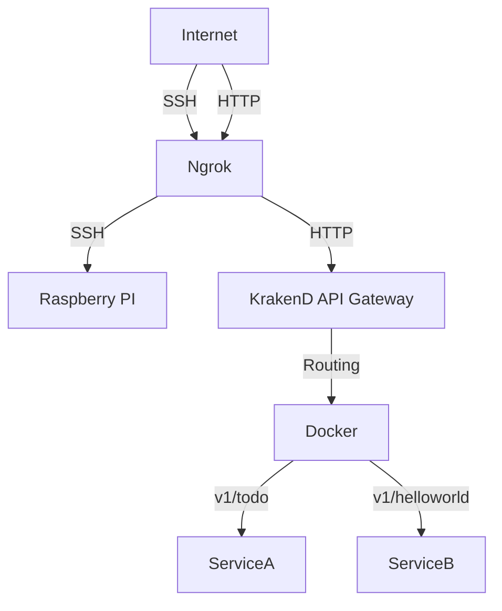

# My Raspberry Pi Setup

This README provides detailed instructions on setting up a Raspberry Pi with various services and tools for managing incoming traffic and routing it to different services.

## Table of Contents
- [Overview](#overview)
- [Requirements](#requirements)
- [Installation](#installation)
  - [Raspberry Pi OS](#raspberry-pi-os)
  - [Ngrok](#ngrok)
  - [KrakenD](#krakend)
  - [Docker](#docker)
- [Configuration](#configuration)
  - [Ngrok Configuration](#ngrok-configuration)
  - [KrakenD Configuration](#krakend-configuration)

## Overview

This setup leverages a Raspberry Pi running Raspberry Pi OS to host various services. Incoming traffic is exposed to the internet using Ngrok and routed to different services via the KrakenD API gateway. Docker is employed for easy management and deployment of these services.

## Requirements

- Raspberry Pi (preferably Raspberry Pi 3 or later)
- MicroSD card (minimum 16GB)
- Stable internet connection
- Ngrok account (free tier available)
- Basic knowledge of Docker

## Installation

### Raspberry Pi OS

1. **Download Raspberry Pi OS:**
   - Visit the [Raspberry Pi website](https://www.raspberrypi.org/software/) to download the latest Raspberry Pi OS image.

2. **Write the Image to the MicroSD Card:**
   - Use tools like [Raspberry Pi Imager](https://www.raspberrypi.org/software/) to write the image to your MicroSD card.

3. **Setup Raspberry Pi:**
   - Insert the MicroSD card into your Raspberry Pi and power it on.
   - Follow the on-screen instructions to complete the initial setup.

## Architecture Diagram

The following Mermaid diagram illustrates the traffic flow and architecture of the Raspberry Pi setup:


This diagram shows how internet traffic flows through Ngrok, then is routed by KrakenD, and reaches the different services managed by Docker on the Raspberry Pi.
### Ngrok

1. **Download and Install Ngrok:**
   - Download Ngrok from the [official website](https://ngrok.com/download).
   - Install using snap:
     ```sh
     snap install ngrok
     ```

2. **Authenticate Ngrok:**
   - Sign up for an Ngrok account and obtain your authentication token.
   - Authenticate your Ngrok installation manual step on the Raspberry PI:
     ```sh
     ngrok authtoken YOUR_AUTH_TOKEN
     ```
### Docker

1. **Install Docker:**
   - See installation [guide](https://docs.docker.com/engine/install/ubuntu/)

2. **Add Your User to the Docker Group:**
   - To run Docker commands without `sudo`:
     ```sh
     sudo usermod -aG docker $USER
     ```
### KrakenD

1. **Download KrakenD:**
   - Download the latest KrakenD binary from the [official website](https://www.krakend.io/download/).

2. **Install KrakenD:**
   - Run the docker command:
     ```sh
     docker pull devopsfaith/krakend:2.7.0
     ```

## Configuration

### Ngrok Configuration

Create an `ngrok.yml` configuration file:
```yaml
authtoken: YOUR_AUTH_TOKEN
tunnels:
  ssh:
    proto: tcp
    addr: 22
  http:
    proto: http
    addr: 8080
```
Start Ngrok with the configuration file:
```sh
ngrok start --all
```

### KrakenD Configuration
```json
{
  "version": 2,
  "name": "My KrakenD API Gateway",
  "port": 8080,
  "endpoints": [
    {
      "endpoint": "/service1",
      "method": "GET",
      "backend": [
        {
          "url_pattern": "/",
          "host": ["http://localhost:8001"]
        }
      ]
}
]    
```
